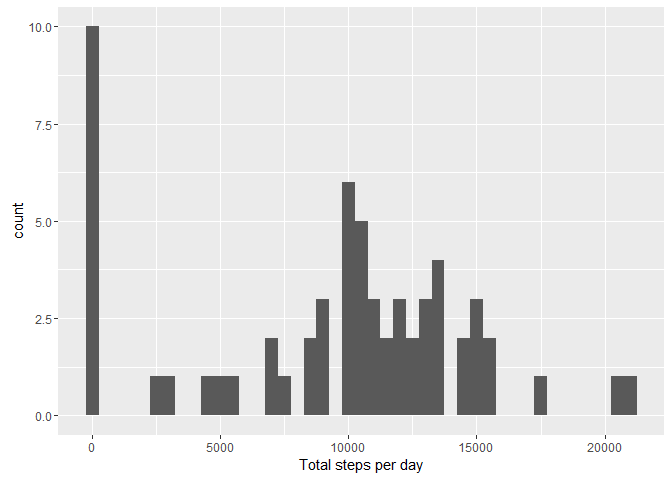
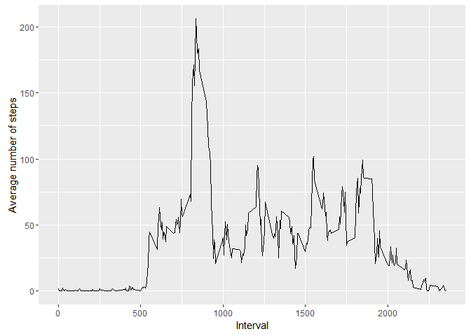
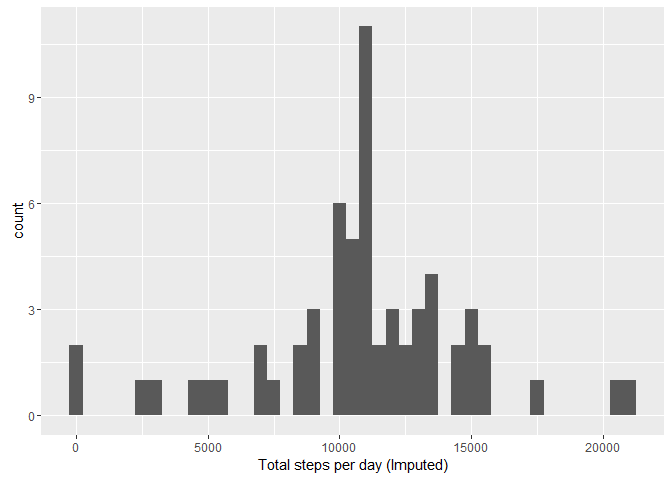
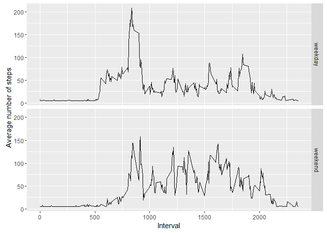

# Reproducible Research: Peer Assessment 1


## Loading and preprocessing the data


```r
activity = read.csv(unzip('activity.zip'))
```


## What is mean total number of steps taken per day?


```r
stepsByDay = with(activity, tapply(steps, date, sum, na.rm=T))

qplot(stepsByDay, xlab='Total steps per day', binwidth=500)
```

<!-- -->

* Mean total number of steps per day: 9354.2295082

* Median total number of steps per day: 10395


## What is the average daily activity pattern?


```r
averageStepsByInterval = aggregate(steps ~ interval, activity, mean, na.rm=T)

ggplot(averageStepsByInterval, aes(x=interval, y=steps)) +
    geom_line() +
    xlab("Interval") +
    ylab("Average number of steps") 
```

<!-- -->


## Imputing missing values

Number of incomplete cases: 2304


```r
activity.imputed = activity
activity.imputed$steps = impute(activity$steps,mean)

stepsByDay = with(activity.imputed, tapply(steps, date, sum, na.rm=T))

qplot(stepsByDay, xlab='Total steps per day (Imputed)', binwidth=500)
```

<!-- -->

* Mean total number of steps per day: 1.0766189\times 10^{4}

* Median total number of steps per day: 1.0766189\times 10^{4}


## Are there differences in activity patterns between weekdays and weekends?


```r
activity.imputed$dayType = ifelse(weekdays(as.Date(activity.imputed$date)) %in%
                                    c('Saturday','Sunday'),'weekend','weekday') 
  
averageStepsByInterval = aggregate(steps ~ interval + dayType, activity.imputed, mean, na.rm=T)

ggplot(averageStepsByInterval, aes(interval, steps)) + 
    geom_line() + 
    facet_grid(dayType ~ .) +
    xlab("Interval") +
    ylab("Average number of steps") 
```

<!-- -->


